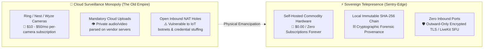
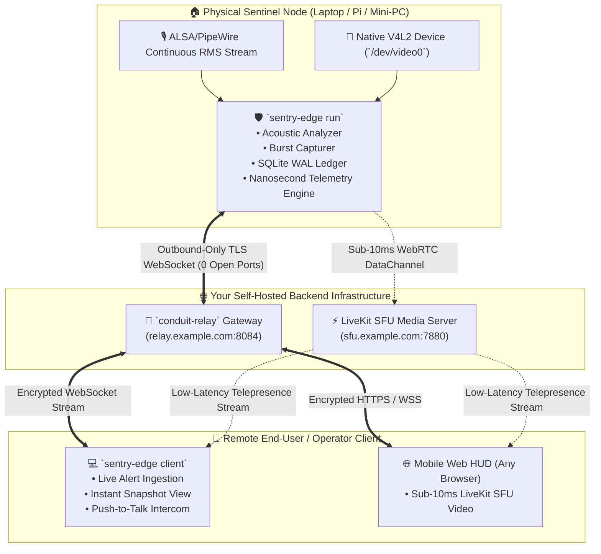

# 🛡️ SENTRY-EDGE (`sentry-edge-rs`)
### *Autonomous Sovereign Telepresence Sentinel & Edge Acoustic Watchdog*

```
  ____  _____ _   _ _____ ______   __  _____ ____   ____ _____ 
 / ___|| ____| \ | |_   _|  _ \ \ / / | ____|  _ \ / ___| ____|
 \___ \|  _| |  \| | | | | |_) \ V /  |  _| | | | | |  _|  _|  
  ___) | |___| |\  | | | |  _ < | |   | |___| |_| | |_| | |___ 
 |____/|_____|_| \_| |_| |_| \_\|_|   |_____|____/ \____|_____|
```

[](https://www.rust-lang.org/)
[](LICENSE)
[](docs/ARCHITECTURE_AND_HAL.md)
[](crates/sentry-hardware)
[-success.svg?style=flat-square)](tests)

---

## 📚 Dedicated Documentation & Field Manuals

* 📖 [**Comprehensive Operator Guide & Field Manual**](docs/OPERATOR_GUIDE.md) (`SENTRY-DOC-OP-01`): Real-world soak deployment walkthrough, 119 verified records, ambient TV/Echo DSP adaptation, handclap spike mechanics (86.2 dB SPL), and the *"If You Wanted to Know / See If..."* operator playbook.
* 📦 [**Installation & Uninstallation Manual**](docs/INSTALLATION_AND_UNINSTALLATION.md) (`SENTRY-DOC-INST-01`): Multi-OS system requirements, static Musl deployment, background daemon supervision, systemd unit integration, and complete clean purge procedures.
* 🛠️ [**Exhaustive Daemon & CLI Reference Manual**](docs/DAEMON_AND_CLI_REFERENCE.md) (`SENTRY-DOC-CLI-01`): Full command-by-command reference for `sentry-daemon.sh` (`start|stop|status|logs|stats|verify|report`) and all `sentry-edge` CLI subcommands with internal mechanics and real-world failure recovery.
* 🏛️ [**Architecture, HAL & Report Engine Specification**](docs/ARCHITECTURE_AND_HAL.md) (`SENTRY-DOC-ARCH-01`): 9-crate micro-OJP taxonomy, trait-based HAL, single-source-of-truth (SST) report orchestrator, 5W1H provenance model, and rolling SHA-256 blockchain hash-chain engine.

---

## 🏛️ System Vision: Why Sentry-Edge?

Commercial security cameras (Ring, Nest, Wyze, Arlo) force an unacceptable privacy compromise: they stream raw home/office video to third-party cloud data centers, enforce monthly recurring SaaS fees, and cannot execute programmable edge logic when internet connectivity drops.

**SENTRY-EDGE** delivers the sovereign, zero-cloud alternative:
* 🛡️ **Zero Open Inbound Ports**: Dials *outward-only* to your self-hosted [**Conduit Relay**](https://github.com/xuoxod/conduit) over encrypted TLS WebSockets.
* 🎙️ **Acoustic Noise Watchdog**: Continuous sliding-window RMS audio analysis detects sudden acoustic anomalies ($+20\text{ dB SPL}$ over baseline, glass breaking, sirens, intrusions).
* 📸 **V4L2 Burst Sentinel**: Automatically triggers a 5-frame 1080p JPEG burst upon acoustic breach with hardware LED isolation (camera powers down immediately after frame release).
* ⚡ **Sub-10ms LiveKit SFU Telepresence**: Stream real-time 60FPS video and two-way walkie-talkie intercom directly to any mobile phone browser worldwide.
* ⏱️ **Nanosecond / Picosecond Provenance**: Meticulous telemetry tracking (`Who`, `From`, `To`, `What`, `How`, `Minutiae`) sealed with an immutable cryptographic SHA-256 blockchain hash chain.
* 📊 **Decoupled SST Report Engine**: Exports self-contained, zero-CDN interactive HTML dashboards, ASCII text dossiers, RFC 4180 CSV, JSON, and Markdown briefs.
* 🔬 **Trait-Based HAL**: Native Linux ALSA & V4L2, macOS CoreAudio & AVFoundation, Windows WASAPI & MediaFoundation, with automatic procedural simulation fallback.
* 📦 **100% Platform-Agnostic Static Binary**: Built with `x86_64-unknown-linux-musl` and `crt-static`, eliminating all `GLIBC_X.XX not found` library mismatches.

---

## ⚡ The Sovereign Frontier: Emancipation from Cloud Surveillance Feudalism

Commercial surveillance hardware companies have created a subscription lock-in racket: you purchase physical cameras, but you don't own the data, you can't run custom edge logic, and your private audio/video streams are uploaded to corporate servers with mandatory monthly recurring fees.

`sentry-edge` delivers the frontier alternative for physical spaces:
* **0 Cloud Subscriptions**: Runs on your own Linux hardware (Raspberry Pi, workstation, mini-PC).
* **0 Inbound Ports**: Dials out directly over encrypted TLS WebSockets to your own private sovereign relay.
* **100% Cryptographic Provenance**: Every acoustic spike and snapshot burst is sealed with an immutable SHA-256 blockchain hash chain that you own forever.



### 🧬 Sovereign Provenance: The Human-AI Vanguard

`sentry-edge` was forged through rigorous human-AI pair programming, pairing human standards of physical privacy and zero-cloud reliance with agentic verification. From trait-based HAL abstraction across Linux, macOS, and Windows to sub-10ms WebRTC pipeline orchestration and immutable SHA-256 blockchain hashing, the codebase proves that independent developers pairing with an AI thinking partner can out-build multi-million dollar corporate hardware surveillance ecosystems.

---

## 🏗️ Ecosystem Architecture



---

## ⚙️ System Requirements

| Component | Minimum Specification | Recommended Specification |
| :--- | :--- | :--- |
| **CPU Architecture** | `x86_64` or `aarch64` | Multi-core x86_64 or Raspberry Pi 4/5 |
| **Memory (RAM)** | $\ge 32\text{ MB}$ total system RAM | $\ge 64\text{ MB}$ total system RAM |
| **Process Footprint** | **$\approx 5.8\text{ MB} - 6.2\text{ MB}$ RSS** | Peak Burst: $7.1\text{ MB}$ RSS |
| **Supported OS** | Linux 2.6+, macOS 11+, Windows 10+, FreeBSD 13+ | Modern Linux (Ubuntu, Debian, Alpine, Arch) |
| **Sensors** | Audio input device (ALSA/WASAPI/CoreAudio) | UVC-compliant USB Webcam (`/dev/video0`) + Mic |

---

## 🚀 Quickstart & Usage

### 1. Build Zero-Dependency Static Release Binary
```bash
# Build 100% standalone static binary (zero host glibc dependencies)
cargo build --release --target x86_64-unknown-linux-musl

# Verify static linking
file target/x86_64-unknown-linux-musl/release/sentry-edge
```

---

### 2. Inspect Host Hardware & HAL Profile
```bash
./target/x86_64-unknown-linux-musl/release/sentry-edge --profile
```

---

### 3. Launch Edge Sentinel Hardware Daemon
```bash
./target/x86_64-unknown-linux-musl/release/sentry-edge run \
    --relay-url wss://relay.example.com:8084/ws/outpost \
    --token sentry-dev-99x \
    --label "Server-Room-Sentinel" \
    --camera /dev/video0 \
    --trigger-db 20.0
```

---

### 4. Generate Multi-Format Dossiers
```bash
# Generate interactive zero-CDN HTML dashboard with expandable forensic drawers:
./target/x86_64-unknown-linux-musl/release/sentry-edge report --format html --output sentry_report.html

# Generate high-impact ASCII plain text dossier for terminal inspection:
./target/x86_64-unknown-linux-musl/release/sentry-edge report --format txt --output sentry_report.txt
```

---

## 🧩 Workspace Crate Taxonomy (Micro-OJP)

| Crate | Responsibility & Invariant |
| :--- | :--- |
| [`crates/sentry-core`](crates/sentry-core) | Core DSP math, acoustic RMS, platform paths, configuration parser, and alert models. |
| [`crates/sentry-hardware`](crates/sentry-hardware) | Trait-based Hardware Abstraction Layer (HAL) for Linux (ALSA/V4L2), macOS, Windows, and Procedural fallback. |
| [`crates/sentry-telemetry`](crates/sentry-telemetry) | Picosecond timers, 5W1H micro-provenance, and immutable rolling SHA-256 blockchain hash-chain engine. |
| [`crates/sentry-ledger`](crates/sentry-ledger) | Embedded SQLite WAL incident database and persistence sink. |
| [`crates/sentry-report`](crates/sentry-report) | Decoupled Single Source of Truth (SST) report orchestrator, narrative storyteller, and 6 multi-format exporters. |
| [`crates/sentry-bridge`](crates/sentry-bridge) | Outbound-only TLS WebSocket tunnel client for Conduit relays. |
| [`crates/sentry-telepresence`](crates/sentry-telepresence) | LiveKit SFU JWT generation and sub-10ms WebRTC 2-way walkie-talkie intercom bridge. |
| [`crates/sentry-client`](crates/sentry-client) | Remote operator HUD and live incoming alert ingestion console. |
| [`crates/sentry-cli`](crates/sentry-cli) | Main binary entrypoint supporting daemon, client, monitor, profile, logs, and report subcommands. |

---

## 📄 License

Licensed under either of:
* Apache License, Version 2.0 ([LICENSE-APACHE](LICENSE-APACHE))
* MIT License ([LICENSE-MIT](LICENSE-MIT))
