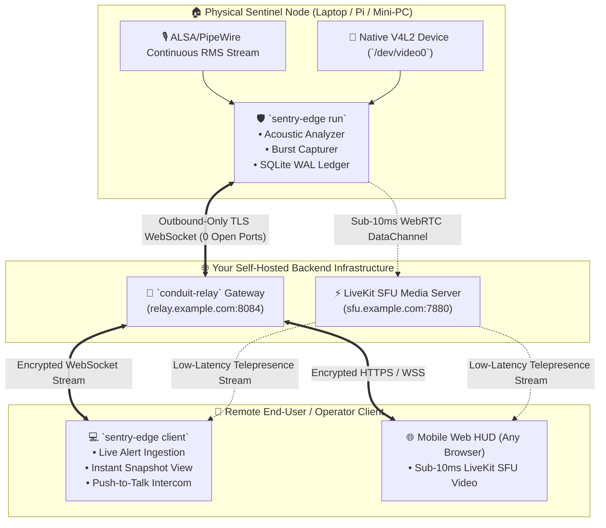

# 🛡️ SENTRY-EDGE (`sentry-edge-rs`)
### *Autonomous Sovereign Telepresence Sentinel & Edge Acoustic Watchdog*

```
  ____  _____ _   _ _____ ______   __  _____ ____   ____ _____ 
 / ___|| ____| \ | |_   _|  _ \ \ / / | ____|  _ \ / ___| ____|
 \___ \|  _| |  \| | | | | |_) \ V /  |  _| | | | | |  _|  _|  
  ___) | |___| |\  | | | |  _ < | |   | |___| |_| | |_| | |___ 
 |____/|_____|_| \_| |_| |_| \_\|_|   |_____|____/ \____|_____|
```

[](https://www.rust-lang.org/)
[](LICENSE)
[](https://github.com/xuoxod/conduit)
[](crates/sentry-hardware)
[](tests)

---

## 🏛️ System Vision: Why Sentry-Edge?

Commercial security cameras (Ring, Nest, Wyze, Arlo) force an unacceptable privacy compromise: they stream raw home/office video to third-party cloud data centers, enforce monthly recurring SaaS fees, and cannot execute programmable edge logic when internet connectivity drops.

**SENTRY-EDGE** delivers the sovereign, zero-cloud alternative:
* 🛡️ **Zero Open Inbound Ports**: Dials *outward-only* to your self-hosted [**Conduit Relay**](https://github.com/xuoxod/conduit) over encrypted TLS WebSockets.
* 🎙️ **Acoustic Noise Watchdog**: Continuous sliding-window RMS audio analysis detects sudden acoustic anomalies ($+20\text{ dB SPL}$ over baseline, glass breaking, sirens, intrusions).
* 📸 **V4L2 Burst Sentinel**: Automatically triggers a 5-frame 1080p JPEG burst upon acoustic breach with hardware LED isolation (camera powers down immediately after frame release).
* ⚡ **Sub-10ms LiveKit SFU Telepresence**: Stream real-time 60FPS video and two-way walkie-talkie intercom directly to any mobile phone browser worldwide.
* 📱 **Two-Sided Architecture**: Includes both the **Edge Hardware Sentinel Daemon** and the **Remote End-User Client App** for live alert feeds and on-demand camera viewing.
* 📜 **Immutable SQLite WAL Ledger**: All incidents are cryptographically signed with SHA-256 and persisted in an embedded SQLite WAL database with dark-mode SVG dossier exports.

---

## 🏗️ Ecosystem Architecture



---

## 🚀 Quickstart & Usage

### 1. Build from Source
```bash
git clone https://github.com/xuoxod/sentry-edge.git
cd sentry-edge
cargo build --release
```

---

### 2. Role A: Launch the Edge Sentinel Daemon (On Monitored Device)
```bash
# Launch background hardware sentinel connected to your self-hosted Conduit Relay
./target/release/sentry-edge run \
    --relay-url wss://relay.example.com:8084/ws/outpost \
    --token your-secret-token \
    --label "Server-Room-Sentinel (hyperion-prime)" \
    --camera /dev/video0 \
    --trigger-db 20.0
```

#### What to Expect on the Edge Machine:
```text
==========================================================================
🛡️  SENTRY-EDGE // AUTONOMOUS SOVEREIGN TELEPRESENCE SENTINEL
==========================================================================
  ✔ [MODE]                : EDGE SENTINEL HARDWARE DAEMON
  ✔ Target Relay URL      : wss://relay.example.com:8084/ws/outpost
  ✔ Node Identity Label   : Server-Room-Sentinel (hyperion-prime)
  ✔ Camera Device         : /dev/video0
  ✔ Acoustic Trigger Delta: +20 dB SPL
==========================================================================
▶ Sentinel armed. Monitoring acoustic baseline & camera...
  [dB Meter] Current: 38.5 dB | Baseline: 35.0 dB
  [dB Meter] Current: 38.5 dB | Baseline: 35.0 dB
🚨 [ACOUSTIC SPIKE DETECTED] Sudden sound burst!
  📸 Capturing 3-frame V4L2 snapshot burst...
  ✔ Dispatched SentryWirePacket #1 over Conduit WSS tunnel!
```

---

### 3. Role B: Launch the Remote End-User Client App (On Your Laptop / Phone)
```bash
# Connect as remote operator to receive live alerts and control the sentinel
./target/release/sentry-edge client \
    --relay-url wss://relay.example.com:8084/ws/operator \
    --operator "Rick-Workstation" \
    --watch-node "Server-Room-Sentinel (hyperion-prime)"
```

#### What to Expect on Your Operator Screen:
```text
==========================================================================
🛡️  SENTRY-EDGE // AUTONOMOUS SOVEREIGN TELEPRESENCE SENTINEL
==========================================================================
  ✔ [MODE]                : END-USER REMOTE OPERATOR CLIENT
  ✔ Target Relay URL      : wss://relay.example.com:8084/ws/operator
  ✔ Operator Identity     : Rick-Workstation
  ✔ Watching Node         : Server-Room-Sentinel (hyperion-prime)
==========================================================================
▶ Connected to Conduit Relay. Awaiting live edge sentinel alerts...

[CRITICAL] [22:27:06] 🚨 Node: Server-Room-Sentinel (hyperion-prime) >> Acoustic Spike (+58.6 dB over baseline | Peak: 94.8 dB)
   Description: Glass shatter / forced entry acoustic frequency detected at Server Rack 02
   Integrity SHA-256: 903ba9da620e5a89

✔ Alert verified & cryptographically authenticated.
```

---

### 4. Role C: Connect Live Two-Way Telepresence & Walkie-Talkie
```bash
# Instant sub-10ms LiveKit SFU WebRTC room creation
sentry-edge telepresence --sfu-url https://sfu.example.com:7880 --target-node hyperion-prime
```

---

### 5. Essential Operator Commands
```bash
# Live real-time audio decibel level meter in terminal
sentry-edge monitor

# Test 880Hz attention warning siren / chime
sentry-edge test-chime

# Capture instant high-resolution V4L2 camera snapshot
sentry-edge snapshot --camera /dev/video0 --output /tmp/snapshot.jpg

# Generate dark-mode HTML security dossier with embedded SVG charts
sentry-edge report --output /tmp/security_dossier.html
```

---

## 🧩 Micro-OJP Multi-Crate Workspace Layout

```
sentry-edge/
├── Cargo.toml                  # Standalone workspace definition (Zero local path dependencies)
├── crates/
│   ├── sentry-core/            # Pure acoustic RMS math, dB SPL calibration & data models
│   ├── sentry-hardware/        # Native Linux V4L2 camera capture & ALSA/PipeWire audio
│   ├── sentry-telepresence/    # Real-time WebRTC LiveKit SFU integration & 2-way intercom
│   ├── sentry-bridge/          # Outbound TLS WebSocket connector linking Sentry to Conduit
│   ├── sentry-ledger/          # SQLite WAL incident persistence & SVG report engine
│   ├── sentry-client/          # End-user remote operator application & alert viewer
│   └── sentry-cli/             # Standalone operator CLI, audio meter & daemon binary
```

---

## 🧪 Test Suite & Verification

```bash
cargo test --workspace
```

---

## 📜 Governance & License

Crafted with sovereign pride by **Rick (`xuoxod`)**.  
Licensed under the [MIT License](LICENSE-MIT) or [Apache-2.0 License](LICENSE-APACHE).
