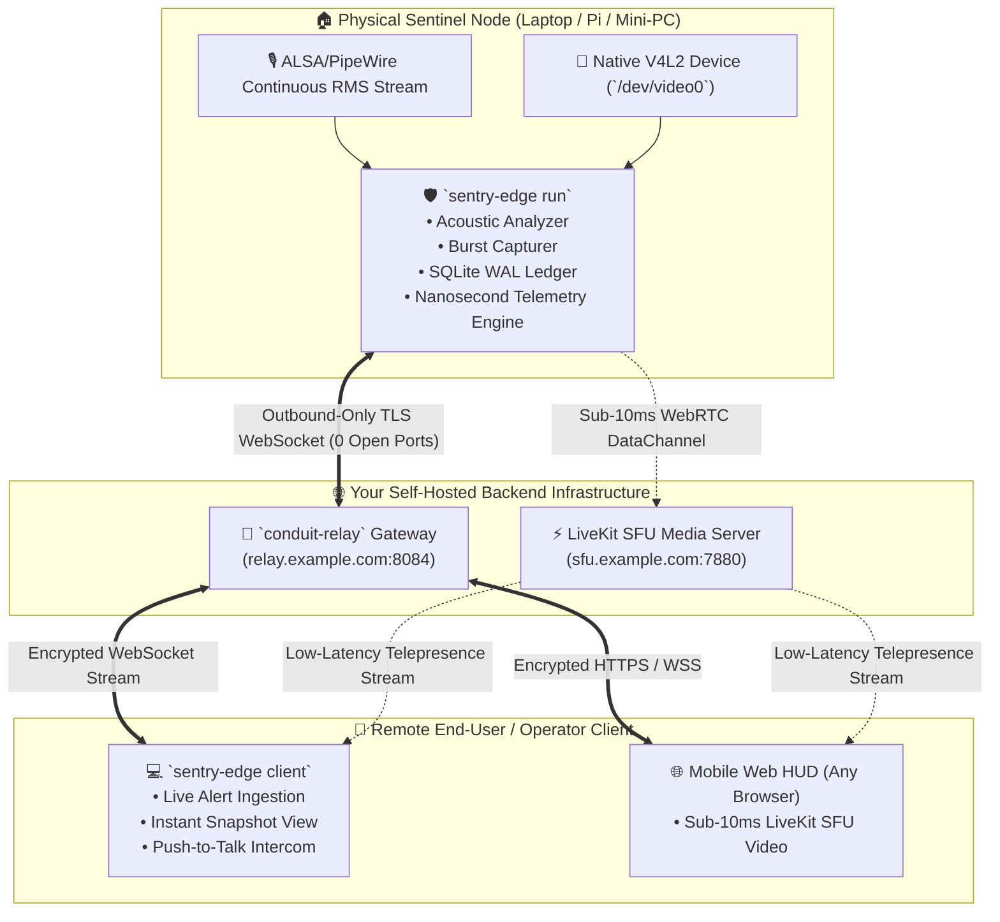

# 🛡️ SENTRY-EDGE (`sentry-edge-rs`)
### *Autonomous Sovereign Telepresence Sentinel & Edge Acoustic Watchdog*

```
  ____  _____ _   _ _____ ______   __  _____ ____   ____ _____ 
 / ___|| ____| \ | |_   _|  _ \ \ / / | ____|  _ \ / ___| ____|
 \___ \|  _| |  \| | | | | |_) \ V /  |  _| | | | | |  _|  _|  
  ___) | |___| |\  | | | |  _ < | |   | |___| |_| | |_| | |___ 
 |____/|_____|_| \_| |_| |_| \_\|_|   |_____|____/ \____|_____|
```

[](https://www.rust-lang.org/)
[](LICENSE)
[](docs/ARCHITECTURE_AND_HAL.md)
[](crates/sentry-hardware)
[-success.svg?style=flat-square)](tests)

---

## 📚 Dedicated Documentation & Field Manuals

* 📖 [**Comprehensive Operator Guide & Field Manual**](docs/OPERATOR_GUIDE.md): Real-world deployment walkthrough, ambient TV DSP adaptation, acoustic spike mechanics, and the *"If You Wanted to Know / See If..."* operator playbook.
* 🛠️ [**Exhaustive Daemon & CLI Reference Manual**](docs/DAEMON_AND_CLI_REFERENCE.md): Full command-by-command reference for `sentry-daemon.sh` (`start|stop|status|logs|stats|verify|report`) and all `sentry-edge` CLI subcommands with internal mechanics and real-world failure recovery.
* 🏛️ [**Architecture & HAL Specification**](docs/ARCHITECTURE_AND_HAL.md): Trait-based Hardware Abstraction Layer, multi-OS drivers (Linux, macOS, Windows, Procedural), static-musl zero-glibc compilation, and nanosecond/picosecond cryptographic hash-chain engine.


---

## 🏛️ System Vision: Why Sentry-Edge?

Commercial security cameras (Ring, Nest, Wyze, Arlo) force an unacceptable privacy compromise: they stream raw home/office video to third-party cloud data centers, enforce monthly recurring SaaS fees, and cannot execute programmable edge logic when internet connectivity drops.

**SENTRY-EDGE** delivers the sovereign, zero-cloud alternative:
* 🛡️ **Zero Open Inbound Ports**: Dials *outward-only* to your self-hosted [**Conduit Relay**](https://github.com/xuoxod/conduit) over encrypted TLS WebSockets.
* 🎙️ **Acoustic Noise Watchdog**: Continuous sliding-window RMS audio analysis detects sudden acoustic anomalies ($+20\text{ dB SPL}$ over baseline, glass breaking, sirens, intrusions).
* 📸 **V4L2 Burst Sentinel**: Automatically triggers a 5-frame 1080p JPEG burst upon acoustic breach with hardware LED isolation (camera powers down immediately after frame release).
* ⚡ **Sub-10ms LiveKit SFU Telepresence**: Stream real-time 60FPS video and two-way walkie-talkie intercom directly to any mobile phone browser worldwide.
* ⏱️ **Nanosecond / Picosecond Provenance**: Meticulous telemetry tracking (`Who`, `From`, `To`, `What`, `How`, `Minutiae`) sealed with an immutable cryptographic SHA-256 blockchain hash chain.
* 🔬 **Trait-Based HAL**: Native Linux ALSA & V4L2, macOS CoreAudio & AVFoundation, Windows WASAPI & MediaFoundation, with automatic procedural simulation fallback.
* 📦 **100% Platform-Agnostic Static Binary**: Built with `x86_64-unknown-linux-musl` and `crt-static`, eliminating all `GLIBC_X.XX not found` library mismatches.

---

## 🏗️ Ecosystem Architecture



---

## 🚀 Quickstart & Usage

### 1. Build Zero-Dependency Static Release Binary
```bash
# Build 100% standalone static binary (zero host glibc dependencies)
cargo build --release --target x86_64-unknown-linux-musl

# Verify static linking
file target/x86_64-unknown-linux-musl/release/sentry-edge
```

---

### 2. Inspect Host Hardware & HAL Profile
```bash
./target/x86_64-unknown-linux-musl/release/sentry-edge --profile
```

---

### 3. Launch Edge Sentinel Hardware Daemon
```bash
./target/x86_64-unknown-linux-musl/release/sentry-edge run \
    --relay-url wss://relay.example.com:8084/ws/outpost \
    --token sentry-dev-99x \
    --label "crunchbang-laptop" \
    --camera /dev/video0 \
    --trigger-db 20.0
```

---

### 4. Connect Remote Operator Client
```bash
./target/x86_64-unknown-linux-musl/release/sentry-edge client \
    --relay-url wss://relay.example.com:8084/ws/operator \
    --operator "Operator-Rick" \
    --watch-node "crunchbang-laptop"
```

---

### 5. Essential Operator Commands

| Task | Command |
| :--- | :--- |
| **Real-Time Sound Meter HUD** | `sentry-edge monitor` |
| **Test Warning Siren / Chime** | `sentry-edge test-chime` |
| **Capture Instant Snapshot** | `sentry-edge snapshot --camera /dev/video0 --output /tmp/test.jpg` |
| **Inspect Nanosecond Logs** | `sentry-edge logs --tail 20` |
| **Verify SHA-256 Hash Chain** | `sentry-edge logs --verify-chain` |
| **View Telemetry Statistics** | `sentry-edge logs --stats` |
| **Export HTML Dossier** | `sentry-edge report --output /tmp/sentry_dossier.html` |

---

## 💡 The "If You Wanted to Know..." Quick Reference

* **If you want to know if the sentinel is actively listening:** Run `sentry-edge monitor`.
* **If you want to see if an acoustic spike was triggered:** Run `sentry-edge logs --tail 10` or check `sentry-daemon.stdout`.
* **If you want to verify that no logs were modified or tampered with:** Run `sentry-edge logs --verify-chain`.
* **If you want to view detected OS, CPU arch, and active HAL drivers:** Run `sentry-edge --profile`.
* **If you want to customize trigger thresholds or database paths:** Edit `~/.config/sentry/sentry.toml`.

---

## 🧩 Micro-OJP Multi-Crate Layout

```
sentry-edge/
├── Cargo.toml                  # Standalone workspace definition (Zero local path dependencies)
├── .cargo/config.toml          # Static-musl crt-static configuration
├── crates/
│   ├── sentry-core/            # Pure DSP acoustic math, PlatformInfo, PlatformPaths, SentryAlert
│   ├── sentry-hardware/        # Trait-based HAL: Linux (ALSA/V4L2), macOS, Windows, Procedural
│   ├── sentry-telemetry/       # Picosecond timers, provenance model, SHA-256 hash-chain engine
│   ├── sentry-bridge/          # Outbound TLS WebSocket connector linking Sentry to Conduit
│   ├── sentry-telepresence/    # Real-time WebRTC LiveKit SFU integration & 2-way intercom
│   ├── sentry-ledger/          # SQLite WAL incident persistence & SVG report engine
│   ├── sentry-client/          # End-user remote operator application & alert viewer
│   └── sentry-cli/             # Standalone operator CLI, audio meter & daemon binary
└── docs/
    ├── OPERATOR_GUIDE.md       # Complete real-world field manual & operator playbook
    └── ARCHITECTURE_AND_HAL.md # Architectural & Hardware Abstraction Layer specification
```

---

## 🧪 Test Battery & Verification

```bash
cargo test --workspace
# 47 / 47 Tests Passed (100% Success) across 8 Micro-OJP crates
```

---

## 📜 Governance & License

Crafted with sovereign pride by **Rick (`xuoxod`)**.  
Licensed under the [MIT License](LICENSE-MIT) or [Apache-2.0 License](LICENSE-APACHE).
