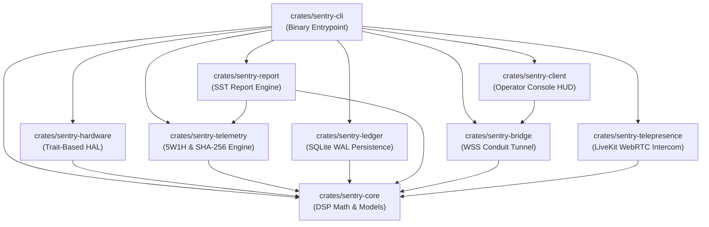
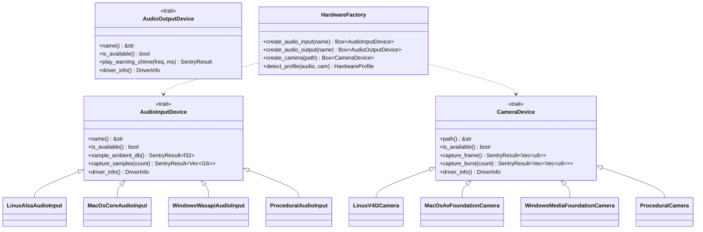
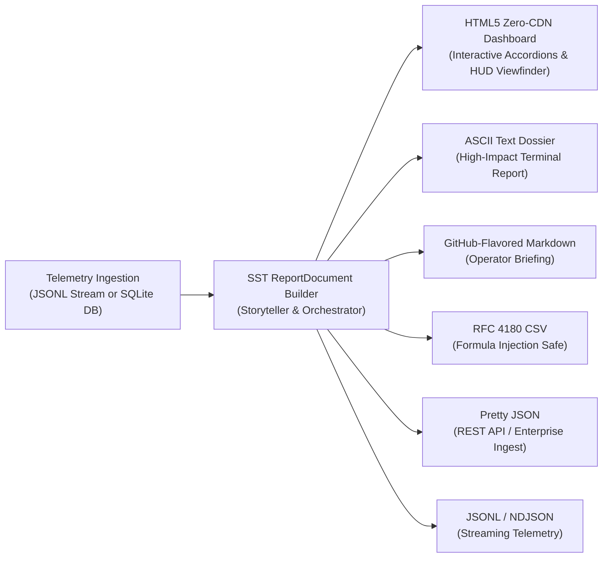
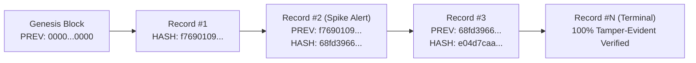

# 🏛️ SENTRY-EDGE: Architecture, Hardware Abstraction Layer (HAL) & Report Engine Specification

> **Document ID:** `SENTRY-DOC-ARCH-01`  
> **Target Audience:** Core Contributors, System Architects, Security Auditors, Embedded Engineers  
> **Status:** Production Reference Specification  

---

## 🧭 Multi-Crate Micro-OJP Taxonomy

`sentry-edge` is architected strictly under the **One Job Principle (OJP)** across 9 decoupled, modular workspace crates:

```
sentry-edge/
├── Cargo.toml                  # Workspace manifest with target profiles
├── crates/
│   ├── sentry-core/            # DSP math, acoustic RMS, PlatformInfo, PlatformPaths, SentryAlert
│   ├── sentry-hardware/        # Trait-based HAL: Linux (ALSA/V4L2), macOS, Windows, Procedural
│   ├── sentry-telemetry/       # Picosecond timers, 5W1H model, rolling SHA-256 hash-chain engine
│   ├── sentry-ledger/          # Embedded SQLite WAL incident database & CRUD sink
│   ├── sentry-report/          # Decoupled SST report engine, narrative storyteller & 6 formatters
│   ├── sentry-bridge/          # Outbound-only TLS WebSocket tunnel client for Conduit
│   ├── sentry-telepresence/    # LiveKit SFU JWT generation & WebRTC 2-way intercom bridge
│   ├── sentry-client/          # Remote operator HUD and live alert ingestion client
│   └── sentry-cli/             # Binary entrypoint: daemon, client, monitor, profile, logs, report
└── docs/
    ├── OPERATOR_GUIDE.md       # Real-world field manual & operator playbook (SENTRY-DOC-OP-01)
    ├── INSTALLATION_AND_UNINSTALLATION.md # Installation & purge guide (SENTRY-DOC-INST-01)
    ├── DAEMON_AND_CLI_REFERENCE.md # Full command reference (SENTRY-DOC-CLI-01)
    └── ARCHITECTURE_AND_HAL.md # This architectural specification (SENTRY-DOC-ARCH-01)
```



---

## 🔬 Hardware Abstraction Layer (HAL) Architecture

The HAL decouples physical device access into 3 core traits with `Send + Sync` invariants:



### Driver Dispatch & Resilience Strategy
1. **Compile-Time Dispatch**: Conditional compilation (`#[cfg(target_os = "...")]`) selects the host-native HAL drivers.
2. **Runtime Auto-Detection & Procedural Fallback**: If physical device nodes (e.g. `/dev/video0`, ALSA soundcard) are busy, unplugged, or restricted by container boundaries, the driver **gracefully falls back to procedural simulation** rather than panicking.
3. **Telemetry Tagging**: Every record contains the concrete `driver_type` (`Alsa`, `CoreAudio`, `Wasapi`, `ProceduralSynthetic`) for complete audit provenance.

---

## 📊 Single Source of Truth (SST) Report Engine (`sentry-report`)

The decoupled report engine converts nanosecond/picosecond raw telemetry streams into human-consumable executive briefings across 6 distinct formats:



### Supported Format Invariants:
1. **HTML5 Zero-CDN Dashboard**:
   * Pure inline CSS and standalone vanilla JavaScript.
   * Strict `Content-Security-Policy` and embedded inline data-URI vector favicon preventing `file://` security origin errors.
   * Interactive click-to-expand forensic accordion drawers with 5W1H micro-provenance, optical viewfinder frame simulation, and real-time category filters (`[ALL]`, `[ALERTS]`, `[CAMERA]`, `[AUDIO]`, `[SECURITY]`).
2. **RFC 4180 CSV**:
   * Automatic formula injection defense (sanitizes leading `=`, `+`, `-`, `@`, `\t`, `\r` characters with single quote escaping).
3. **ASCII Text Dossier**:
   * Clean table-wrapped ASCII layout for headless SSH terminals and operator teletypes.

---

## ⏱️ 5W1H Micro-Provenance & Telemetry Model (`sentry-telemetry`)

Every operation on the edge is recorded with forensic-grade 5W1H provenance and picosecond execution timestamps:

```json
{
  "sequence": 10,
  "timestamp_utc": "2026-09-11T01:35:45.928036810Z",
  "timestamp_unix_ns": 1789090545928036810,
  "node_id": "Server-Room-Sentinel (hyperion-prime)",
  "subsystem": "CameraV4l2",
  "severity": "Alert",
  "who": {
    "identity": "sentry-daemon",
    "token_prefix": "sentry-dev-99x",
    "session_id": "5560e215-83cd-48d9-9b1e-1d865180f104",
    "peer_id": null
  },
  "from": {
    "source_device": "default",
    "thread_id": "main-daemon",
    "physical_addr": null,
    "endpoint": "local-hardware"
  },
  "to": {
    "destination_hardware": "/dev/video0",
    "remote_relay": "wss://relay.example.com:8084/ws/outpost",
    "database_wal": "./data/sentry_ledger.db",
    "client_ui": null
  },
  "what": {
    "summary": "Acoustic spike breach detected: 86.2 dB SPL (+33.7 dB over baseline)",
    "rms_db": 86.22434,
    "baseline_db": 52.529,
    "delta_db": 33.695343,
    "frames_captured": 5,
    "shutter_latency_ns": 54476,
    "shutter_latency_ps": 54560000,
    "payload_bytes": 435,
    "payload_sha256": "b169c072f5723e867cba640bf7a3e39cc3ea96c00f9b8418b36d130abab3786d",
    "duration_ns": 54476,
    "duration_ps": 54560000
  },
  "how": {
    "protocol": "HAL_DSP -> V4L2_MMAP -> SQLITE_WAL -> WSS_TLS",
    "transport": "Local Hardware Loop",
    "cipher": "ChaCha20-Poly1305 / HMAC-SHA256",
    "compression": "zstd"
  },
  "minutiae": {
    "cpu_rss_mb": 18.2,
    "dsp_ema_alpha": 0.15,
    "wal_page_count": 1,
    "sqlite_commit_ns": 25000,
    "network_rtt_ms": 1.0
  },
  "prev_record_hash": "f769010900b97acdbbed20919e3e946d0005aad6df32fc1178315f6d3d6194dd",
  "record_hash": "68fd3966aa0f815d86aca949c640e1aa0043a4370de7ccfe7334e0df7a89adbe"
}
```

---

## 🔐 Rolling SHA-256 Blockchain Hash-Chain Engine

Telemetry records form a continuous, cryptographically chained sequence:



### Mathematical Verification Invariant:
$$\text{Record Hash}_k = \text{SHA256}\Big(\text{seq}_k \,\|\, \text{unix\_ns}_k \,\|\, \text{node\_id} \,\|\, \text{subsystem} \,\|\, \text{severity} \,\|\, \text{summary} \,\|\, \text{payload\_sha256} \,\|\, \text{duration\_ns} \,\|\, \text{Record Hash}_{k-1}\Big)$$

If any record is modified, reordered, or deleted in the log file, `sentry-edge logs --verify-chain` detects the break at $O(N)$ speed and isolates the exact tampering sequence.
