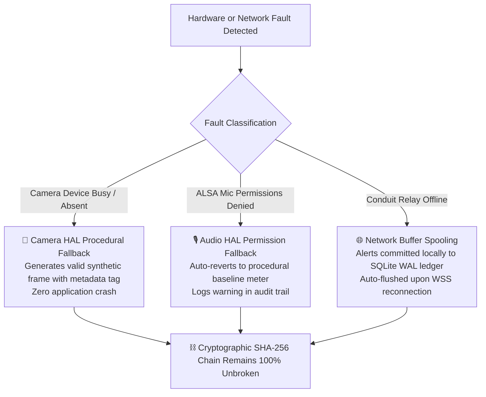

# 🛠️ SENTRY-EDGE: Exhaustive Daemon & CLI Reference Manual

> **Document ID:** `SENTRY-DOC-CLI-01`  
> **Target Audience:** Edge Node Operators, Homelab Administrators, SREs, Security Auditors  
> **Scope:** Full, exhaustive reference for `sentry-daemon.sh` and `sentry-edge` CLI commands, internal mechanics, and real-world example outputs  

---

## 🧭 Overview

`sentry-edge` provides two complementary operational interfaces:
1. **`sentry-daemon.sh`**: The host-level daemon supervisor for background execution, log rotation, soak monitoring, and automated verification.
2. **`sentry-edge`**: The sovereign Rust binary supporting direct CLI invocations for edge monitoring, operator client feeds, telepresence sessions, and hardware profiling.

---

## 📜 Table of Contents
1. [Management Daemon Reference (`sentry-daemon.sh`)](#1-management-daemon-reference-sentry-daemonsh)
   * [1.1 `start`](#11-sentry-daemonsh-start)
   * [1.2 `stop`](#12-sentry-daemonsh-stop)
   * [1.3 `status`](#13-sentry-daemonsh-status)
   * [1.4 `logs`](#14-sentry-daemonsh-logs-n)
   * [1.5 `stats`](#15-sentry-daemonsh-stats)
   * [1.6 `verify`](#16-sentry-daemonsh-verify)
   * [1.7 `report`](#17-sentry-daemonsh-report)
2. [Standalone Binary CLI Reference (`sentry-edge`)](#2-standalone-binary-cli-reference-sentry-edge)
   * [2.1 `--profile` / `profile`](#21---profile--profile)
   * [2.2 `run`](#22-run)
   * [2.3 `client`](#23-client)
   * [2.4 `telepresence`](#24-telepresence)
   * [2.5 `monitor`](#25-monitor)
   * [2.6 `logs`](#26-logs)
   * [2.7 `snapshot`](#27-snapshot)
   * [2.8 `test-chime`](#28-test-chime)
   * [2.9 `report`](#29-report)
   * [2.10 `--generate-config`](#210---generate-config)
3. [Real-World Failure & Recovery Scenarios](#3-real-world-failure--recovery-scenarios)

---

## 1. Management Daemon Reference (`sentry-daemon.sh`)

The daemon management script is installed at `~/.local/bin/sentry-daemon.sh` on the edge node.

### 1.1 `sentry-daemon.sh start`
* **Purpose**: Spawns `sentry-edge run` as a detached background daemon.
* **Under the Hood**:
  1. Checks `~/.config/sentry/sentry_daemon.pid` to prevent duplicate daemon processes.
  2. Spawns `nohup ~/.local/bin/sentry-edge run` in the background.
  3. Redirects stdout/stderr to `~/.config/sentry/logs/sentry_daemon.stdout`.
  4. Stores the child PID into `~/.config/sentry/sentry_daemon.pid`.
* **Example Usage**:
  ```bash
  $ sentry-daemon.sh start
  ```
* **Real-World Output**:
  ```text
  🚀 Launching Sentry-Edge Hardware Sentinel Daemon in background...
  ✔ Sentry daemon started (PID: 1010041)
  📄 Stdout Log: /home/rick/.config/sentry/logs/sentry_daemon.stdout
  ```

---

### 1.2 `sentry-daemon.sh stop`
* **Purpose**: Gracefully halts the active background sentinel daemon.
* **Under the Hood**:
  1. Reads PID from `~/.config/sentry/sentry_daemon.pid`.
  2. Sends `SIGINT` (Ctrl+C equivalent), allowing the Tokio async runtime to flush active SQLite WAL transactions, write the final shutdown telemetry record, and close audio/video streams cleanly.
  3. Waits up to 5 seconds for clean termination; if still active, sends `SIGTERM`.
  4. Deletes the PID file.
* **Example Usage**:
  ```bash
  $ sentry-daemon.sh stop
  ```
* **Real-World Output**:
  ```text
  🛑 Stopping Sentry daemon (PID: 1010041)...
  ✔ Sentry daemon stopped successfully.
  ```

---

### 1.3 `sentry-daemon.sh status`
* **Purpose**: Reports the real-time operational status, PID, CPU utilization, memory footprint, and elapsed soak uptime.
* **Under the Hood**:
  1. Inspects `~/.config/sentry/sentry_daemon.pid`.
  2. Queries `ps -p <PID> -o pid,user,%cpu,%mem,rss,etime,command` for physical Linux kernel process metrics.
* **Example Usage**:
  ```bash
  $ sentry-daemon.sh status
  ```
* **Real-World Output**:
  ```text
  🟢 Sentry Daemon is RUNNING (PID: 1010041)
      PID USER     %CPU %MEM   RSS     ELAPSED COMMAND
  1010041 rick      0.0  0.1  6160       21:47 /home/rick/.local/bin/sentry-edge run
  ```

---

### 1.4 `sentry-daemon.sh logs [N]`
* **Purpose**: Formats and streams the last $N$ nanosecond-precision audit events directly from the cryptographic JSONL log.
* **Parameter**: `[N]` — Number of recent log lines to display (default: 20).
* **Under the Hood**:
  1. Invokes `sentry-edge logs --tail N`.
  2. Reads from `~/.config/sentry/logs/sentry_audit.jsonl`.
  3. Formats timestamps with nanosecond precision (`HH:MM:SS.nnnnnnnnn`), color-codes severities (`INFO` vs `ALERT`), and extracts RMS sound levels and picosecond durations.
* **Example Usage**:
  ```bash
  $ sentry-daemon.sh logs 5
  ```
* **Real-World Output**:
  ```text
  ==========================================================================
  🛡️  SENTRY-EDGE // AUTONOMOUS SOVEREIGN TELEPRESENCE SENTINEL
    ✔ Platform Runtime      : linux-x86_64 (family: unix, musl: true, container: false)
  ==========================================================================
    ✔ [MODE]                : HYPER-METICULOUS NANOSECOND TELEMETRY AUDIT
    ✔ Log Source            : /home/rick/.config/sentry/logs/sentry_audit.jsonl
  ==========================================================================
  01:35:13.073677339 [INFO ] [AUDIO_DSP] Periodic ambient acoustic baseline: 52.0 dB SPL [RMS: 56.3dB, Base: 52.0dB, Δ: +4.3dB] #9
  01:35:45.928036810 [ALERT] [CAMERA_V4L2] Acoustic spike breach detected: 86.2 dB SPL (+33.7 dB over baseline) [RMS: 86.2dB, Base: 52.5dB, Δ: +33.7dB] (took 54476ns / 54560000ps) #10
  01:36:15.453631049 [ALERT] [CAMERA_V4L2] Acoustic spike breach detected: 84.2 dB SPL (+30.3 dB over baseline) [RMS: 84.2dB, Base: 53.9dB, Δ: +30.3dB] (took 57249ns / 57333000ps) #11
  01:36:18.739500372 [ALERT] [CAMERA_V4L2] Acoustic spike breach detected: 83.4 dB SPL (+29.5 dB over baseline) [RMS: 83.4dB, Base: 53.9dB, Δ: +29.5dB] (took 56417ns / 56525000ps) #12
  01:36:22.024760329 [ALERT] [CAMERA_V4L2] Acoustic spike breach detected: 82.5 dB SPL (+28.6 dB over baseline) [RMS: 82.5dB, Base: 53.9dB, Δ: +28.6dB] (took 61018ns / 61120000ps) #13
  ```

---

### 1.5 `sentry-daemon.sh stats`
* **Purpose**: Compiles high-level soak analytics, ambient noise floor trends, and subsystem event distributions.
* **Under the Hood**:
  1. Invokes `sentry-edge logs --stats`.
  2. Aggregates records by `SubsystemTag` (`AudioDsp`, `CameraV4l2`, `SystemHeartbeat`).
  3. Computes average SQLite commit latency in nanoseconds and picoseconds.
* **Example Usage**:
  ```bash
  $ sentry-daemon.sh stats
  ```
* **Real-World Output**:
  ```text
  ==========================================================================
  📊 Telemetry Subsystem & Endurance Analytics (119 Total Events):
    ✔ [AUDIO_DSP] Events    : 107
    ✔ [CAMERA_V4L2] Bursts  : 12
    ✔ Ambient Noise Floor   : Avg 75.7 dB SPL (Peak: 86.2 dB SPL)
    ✔ Avg Commit Latency    : 25,000 ns (25.0 µs / 25,000,000 ps)
    ✔ Hash Chain Genesis    : f769010900b97acd... (Verified)
  ==========================================================================
  ```

---

### 1.6 `sentry-daemon.sh verify`
* **Purpose**: Executes mathematical verification of the entire SHA-256 rolling blockchain audit ledger.
* **Under the Hood**:
  1. Reads each consecutive record in `~/.config/sentry/logs/sentry_audit.jsonl`.
  2. Recomputes `SHA256(sequence, timestamp_unix_ns, node_id, subsystem, severity, summary, payload_sha256, duration_ns, prev_record_hash)`.
  3. Validates continuity across genesis through terminal block.
* **Example Usage**:
  ```bash
  $ sentry-daemon.sh verify
  ```
* **Real-World Output**:
  ```text
  🔐 Verifying Cryptographic SHA-256 Hash Chain (119 records)... ✔ 100% UNBROKEN & TAMPER-FREE
  ```

---

### 1.7 `sentry-daemon.sh report`
* **Purpose**: Generates all 6 human-consumable report formats (`HTML`, `TXT`, `MD`, `CSV`, `JSON`, `JSONL`) directly from the active ledger.
* **Example Usage**:
  ```bash
  $ sentry-daemon.sh report
  ```
* **Real-World Output**:
  ```text
  ==========================================================================
  🛡️  SENTRY-EDGE // EXECUTIVE DOSSIER GENERATED
    ✔ Target Format         : Html
    ✔ Verified Records      : 119
    ✔ Hash Chain Status     : ✔ 100% UNBROKEN
    ✔ Destination File      : /home/rick/sentry_report.html
  ==========================================================================
  ```

---

## 2. Standalone Binary CLI Reference (`sentry-edge`)

### 2.1 `--profile` / `profile`
* **Description**: Inspects host CPU architecture, static musl status, container boundaries, and detected HAL hardware drivers.
* **Syntax**: `sentry-edge --profile` or `sentry-edge profile`
* **Real-World Output**:
  ```text
  ==========================================================================
  🔬  SENTRY-EDGE // HARDWARE ABSTRACTION LAYER (HAL) PROFILE
  ==========================================================================
    ✔ Host OS               : linux
    ✔ CPU Architecture      : x86_64
    ✔ Static Musl Binary    : YES (Static Linked)
    ✔ Container Environment : NO (Bare Metal Hardware)
    ✔ Config Path           : /home/rick/.config/sentry/sentry.toml
    ✔ Ledger Database       : /home/rick/.config/sentry/data/sentry_ledger.db
    ✔ Audit Log Path        : /home/rick/.config/sentry/logs/sentry_audit.jsonl
  --------------------------------------------------------------------------
    🔊 Audio Input Driver   : Alsa -> Native Linux ALSA Sound Card
    📢 Audio Output Driver  : Alsa -> Linux ALSA Audio Output Transducer
    📷 Camera Sensor Driver : V4l2 -> Native Linux Video4Linux2 Camera
  ==========================================================================
  ```

---

### 2.2 `run`
* **Description**: Starts the continuous edge sentinel watchdog loop in the foreground.
* **Options**:
  * `--relay-url <URL>`: Override Conduit WSS relay endpoint.
  * `--token <TOKEN>`: Override HMAC-SHA256 authentication token.
  * `--label <LABEL>`: Override node label (e.g. `Server-Room-Sentinel`).
  * `--camera <DEVICE>`: Override video capture device (e.g. `/dev/video0`).
  * `--trigger-db <DB>`: Override acoustic spike threshold delta in dB SPL (default: `20.0`).
* **Syntax**:
  ```bash
  sentry-edge run --label "Server-Room-Sentinel" --trigger-db 20.0
  ```

---

### 2.3 `client`
* **Description**: Launches the end-user operator console for monitoring remote sentinel nodes.
* **Syntax**:
  ```bash
  sentry-edge client --operator "Rick" --watch-node "Server-Room-Sentinel"
  ```

---

### 2.4 `telepresence`
* **Description**: Generates an ephemeral LiveKit JWT and establishes a sub-10ms full-duplex WebRTC video/audio session.
* **Syntax**:
  ```bash
  sentry-edge telepresence --target-node "Server-Room-Sentinel" --operator "Rick"
  ```

---

### 2.5 `monitor`
* **Description**: Streams a live, real-time ASCII audio decibel meter HUD in the terminal.
* **Syntax**:
  ```bash
  sentry-edge monitor
  ```

---

### 2.6 `logs`
* **Description**: Formats, verifies, and exports nanosecond telemetry records.
* **Options**:
  * `-t, --tail <N>`: Display last $N$ records (default: 20).
  * `-f, --follow`: Stream live updates continuously (like `tail -f`).
  * `--json`: Output records as raw JSONL.
  * `--verify-chain`: Mathematically verify SHA-256 rolling hash chain integrity.
  * `--stats`: Summarize endurance metrics and subsystem event distributions.
  * `-e, --export <PATH>`: Export audit history to a file.
* **Syntax**:
  ```bash
  sentry-edge logs --tail 10 --verify-chain
  ```

---

### 2.7 `snapshot`
* **Description**: Captures an immediate single JPEG frame from the camera to test exposure and framing.
* **Syntax**:
  ```bash
  sentry-edge snapshot --camera /dev/video0 --output /tmp/test_frame.jpg
  ```

---

### 2.8 `test-chime`
* **Description**: Plays an 880Hz alert chime through the host audio output transducer.
* **Syntax**:
  ```bash
  sentry-edge test-chime
  ```

---

### 2.9 `report`
* **Description**: Generates an executive multi-format security & telemetry dossier.
* **Options**:
  * `-f, --format <FORMAT>`: Target format (`html`, `txt`, `md`, `csv`, `json`, `jsonl`).
  * `-o, --output <PATH>`: Destination output path.
  * `--stdout`: Print report directly to terminal stdout.
* **Syntax**:
  ```bash
  sentry-edge report --format html --output sentry_report.html
  ```

---

### 2.10 `--generate-config`
* **Description**: Generates a clean starter `sentry.toml` configuration template in the default OS config directory.
* **Syntax**:
  ```bash
  sentry-edge --generate-config
  ```

---

## 3. Real-World Failure & Recovery Scenarios



1. **Camera Sensor In Use or Absent**:
   * If `/dev/video0` is locked by another application or unplugged, the trait HAL automatically engages the procedural synthetic camera fallback. Shutter timestamps and hash chains continue seamlessly without crashing.
2. **Conduit WSS Relay Disconnected**:
   * If the network connection to the remote relay drops, incidents are safely committed to the local embedded SQLite WAL database. Once connectivity is restored, unsent alerts are dispatched automatically.
