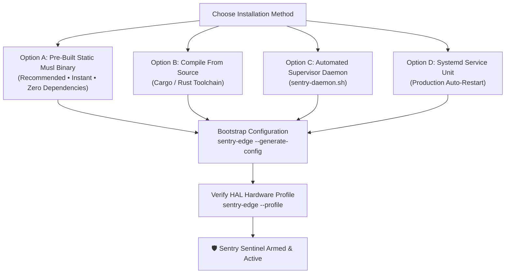
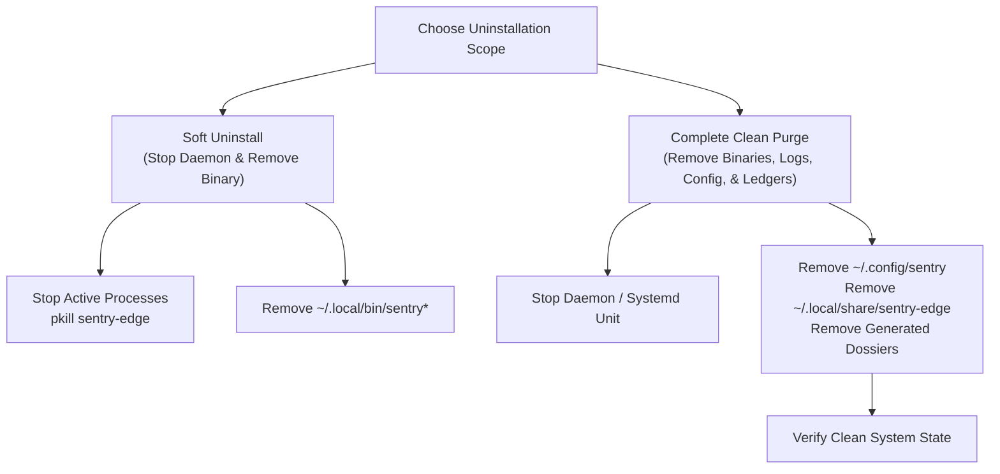

# 📦 SENTRY-EDGE: Comprehensive Installation & Uninstallation Manual

> **Document ID:** `SENTRY-DOC-INST-01`  
> **Target Audience:** System Administrators, Edge Operators, Homelab Architects, Security Engineers  
> **Scope:** System Requirements, Multi-Platform Installation Options, Configuration Bootstrapping, Daemon Supervision, and Complete Uninstallation / Purge Procedures  

---

## 🧭 Overview

`sentry-edge` is engineered for zero-friction deployment across edge hardware, bare-metal servers, virtual machines, and embedded micro-nodes. Because it compiles to a **100% static, standalone Musl binary (`x86_64-unknown-linux-musl`)**, it requires **zero external dynamic libraries (`glibc`, `libasound`, `libv4l`)** and runs out of the box on any Linux distribution (Ubuntu, Debian, Crunchbang, Alpine, Arch, RHEL) regardless of kernel or libc version.

---

## ⚙️ 1. System Requirements & Hardware Prerequisites

### 1.1 Minimum Hardware Specifications

| Attribute | Minimum Requirement | Recommended Specification |
| :--- | :--- | :--- |
| **CPU Architecture** | `x86_64` (AMD64) or `aarch64` (ARM64 / Apple Silicon) | Modern Dual-Core x86_64 or Raspberry Pi 4/5 |
| **Memory (RAM)** | $\ge 32\text{ MB}$ total system RAM | $\ge 64\text{ MB}$ total system RAM |
| **Process Footprint** | **$\approx 5.8\text{ MB} - 6.2\text{ MB}$ Resident Set Size (RSS)** | Idle: $5.8\text{ MB}$ \| Peak Burst: $7.1\text{ MB}$ |
| **Storage (Disk)** | $\ge 20\text{ MB}$ free disk space | $\ge 100\text{ MB}$ free disk space (for extended WAL logs) |
| **Microphone Sensor** | Built-in laptop mic, USB webcam mic, or 3.5mm ALSA input | Dedicated directional USB microphone / array |
| **Camera Sensor** | USB V4L2 Webcam (`/dev/video0`) or Built-in Camera | 720p/1080p UVC Compliant Webcam |
| **Network** | Outbound-only internet connection ($\ge 64\text{ kbps}$) | Stable LAN/Wi-Fi connection to Conduit Relay |

### 1.2 Operating System & Kernel Support

* **Linux**: Kernel 2.6.32+ (Ubuntu 16.04 - 24.04, Debian 8 - 12, Crunchbang, Alpine Linux, Arch Linux, Fedora, RHEL, Raspberry Pi OS).
* **macOS**: macOS 11.0 (Big Sur) through macOS 15+ (Sequoia) via native CoreAudio / AVFoundation drivers.
* **Windows**: Windows 10 / 11 / Server 2019+ via native WASAPI / MediaFoundation drivers.
* **Headless / Container**: Docker, Podman, LXC, MicroVMs (automatically engages procedural fallback HAL if physical sensors are absent).

### 1.3 Linux User Permissions & Device Access
To enable non-root audio capture and camera burst shuttering:
```bash
# Add current user to audio and video groups
sudo usermod -aG audio,video $USER

# Reload group permissions (or log out and log back in)
newgrp audio
newgrp video
```

---

## 🚀 2. Installation Options



---

### Option A: Pre-Built Static Musl Binary (Recommended)

1. **Download the pre-compiled static binary**:
   ```bash
   # Download standalone executable
   mkdir -p ~/.local/bin
   cp target/x86_64-unknown-linux-musl/release/sentry-edge ~/.local/bin/sentry-edge
   chmod +x ~/.local/bin/sentry-edge

   # Ensure ~/.local/bin is in your PATH
   export PATH="$HOME/.local/bin:$PATH"
   ```

2. **Verify standalone static linking**:
   ```bash
   file ~/.local/bin/sentry-edge
   ```
   **Expected Output:**
   ```text
   /home/rick/.local/bin/sentry-edge: ELF 64-bit LSB pie executable, x86-64, version 1 (SYSV), statically linked, stripped
   ```

---

### Option B: Build From Source (Cargo Toolchain)

1. **Clone the repository**:
   ```bash
   git clone https://github.com/xuoxod/sentry-edge.git
   cd sentry-edge
   ```

2. **Compile with static Musl target**:
   ```bash
   # Add musl target if not already installed
   rustup target add x86_64-unknown-linux-musl

   # Build optimized production release
   cargo build --release --target x86_64-unknown-linux-musl
   ```

3. **Install binary to system path**:
   ```bash
   install -m 755 target/x86_64-unknown-linux-musl/release/sentry-edge ~/.local/bin/sentry-edge
   ```

---

### Option C: Supervised Background Daemon (`sentry-daemon.sh`)

For edge deployments requiring background execution, log rotation, and soak testing:

1. **Copy the supervisor script**:
   ```bash
   cp scripts/sentry-daemon.sh ~/.local/bin/sentry-daemon.sh
   chmod +x ~/.local/bin/sentry-daemon.sh
   ```

2. **Start the background watchdog**:
   ```bash
   sentry-daemon.sh start
   ```

3. **Check operational status**:
   ```bash
   sentry-daemon.sh status
   ```
   **Expected Output:**
   ```text
   🟢 Sentry Daemon is RUNNING (PID: 1010041)
       PID USER     %CPU %MEM   RSS     ELAPSED COMMAND
   1010041 rick      0.0  0.1  6160       12:34 /home/rick/.local/bin/sentry-edge run
   ```

---

### Option D: Production Systemd Service Unit

For edge devices requiring automatic start on boot and crash recovery:

1. **Create the systemd service file** at `~/.config/systemd/user/sentry-edge.service`:
   ```ini
   [Unit]
   Description=Sentry-Edge Autonomous Sovereign Telepresence Sentinel
   After=network.target sound.target

   [Service]
   Type=simple
   ExecStart=%h/.local/bin/sentry-edge run
   Restart=always
   RestartSec=5
   StandardOutput=append:%h/.config/sentry/logs/sentry_daemon.stdout
   StandardError=append:%h/.config/sentry/logs/sentry_daemon.stdout
   LimitNOFILE=65535

   [Install]
   WantedBy=default.target
   ```

2. **Enable and start the service**:
   ```bash
   # Enable linger so service runs without active login session
   loginctl enable-linger $USER

   # Reload systemd user daemon and start sentry-edge
   systemctl --user daemon-reload
   systemctl --user enable --now sentry-edge.service
   ```

3. **Inspect service status**:
   ```bash
   systemctl --user status sentry-edge.service
   ```

---

## ⚙️ 3. Initial Configuration Setup

1. **Generate default starter configuration template**:
   ```bash
   sentry-edge --generate-config
   ```
   **Expected Output:**
   ```text
   ==========================================================================
   ⚙️   SENTRY-EDGE // CONFIGURATION GENERATOR
   ==========================================================================
     ✔ Target File Path      : /home/rick/.config/sentry/sentry.toml
     ✔ Platform Profile      : linux-x86_64 (family: unix, musl: true, container: false)
     ✔ Template Status       : Successfully Generated Starter Configuration
   ==========================================================================
   ℹ️  Edit /home/rick/.config/sentry/sentry.toml to customize your backend relay and camera devices.
   ```

2. **Directory & File Hierarchy**:
   ```
   ~/.config/sentry/
   ├── sentry.toml               # Primary TOML configuration file
   ├── data/
   │   └── sentry_ledger.db      # Embedded SQLite WAL audit database
   └── logs/
       ├── sentry_audit.jsonl    # Nanosecond cryptographic SHA-256 event log
       └── sentry_daemon.stdout  # Supervisor console output
   ```

3. **Inspect and verify hardware detection**:
   ```bash
   sentry-edge --profile
   ```

---

## 🗑️ 4. Uninstallation & Clean Purge Procedures



---

### 4.1 Soft Uninstall (Preserve Config & Audit History)
To remove the application binary while retaining your historical SQLite ledgers and cryptographic audit logs:

```bash
# 1. Stop active daemon or systemd service
systemctl --user stop sentry-edge.service 2>/dev/null || true
sentry-daemon.sh stop 2>/dev/null || true
pkill -f sentry-edge 2>/dev/null || true

# 2. Remove executables and scripts
rm -f ~/.local/bin/sentry-edge
rm -f ~/.local/bin/sentry-daemon.sh

echo "✔ Sentry-Edge binaries removed. Configuration and audit logs preserved in ~/.config/sentry/"
```

---

### 4.2 Complete Clean Purge (Remove Everything)
To completely remove all traces of `sentry-edge`, including configuration files, SQLite incident databases, cryptographic JSONL logs, PID files, and generated dossiers:

```bash
# 1. Stop all active processes and services
systemctl --user disable --now sentry-edge.service 2>/dev/null || true
rm -f ~/.config/systemd/user/sentry-edge.service 2>/dev/null || true
systemctl --user daemon-reload 2>/dev/null || true

sentry-daemon.sh stop 2>/dev/null || true
pkill -9 -f sentry-edge 2>/dev/null || true

# 2. Remove all binaries and supervisor scripts
rm -f ~/.local/bin/sentry-edge
rm -f ~/.local/bin/sentry-daemon.sh

# 3. Purge configuration, SQLite databases, and telemetry logs
rm -rf ~/.config/sentry
rm -rf ~/.local/share/sentry-edge

# 4. Remove any generated report dossiers in home directory
rm -f ~/sentry_report.html ~/sentry_report.json ~/sentry_report.jsonl ~/sentry_report.csv ~/sentry_report.txt ~/sentry_report.md ~/sentry_snap.jpg

echo "✔ Complete clean purge verified. Zero Sentry-Edge artifacts remain on this system."
```

---

### 4.3 Automated Verification Script
Verify that your machine is 100% clean:
```bash
pgrep -fl sentry-edge || echo "✔ No active sentry processes"
ls -la ~/.local/bin/sentry* 2>/dev/null || echo "✔ No sentry binaries in ~/.local/bin"
ls -la ~/.config/sentry 2>/dev/null || echo "✔ No config directory in ~/.config/sentry"
```
